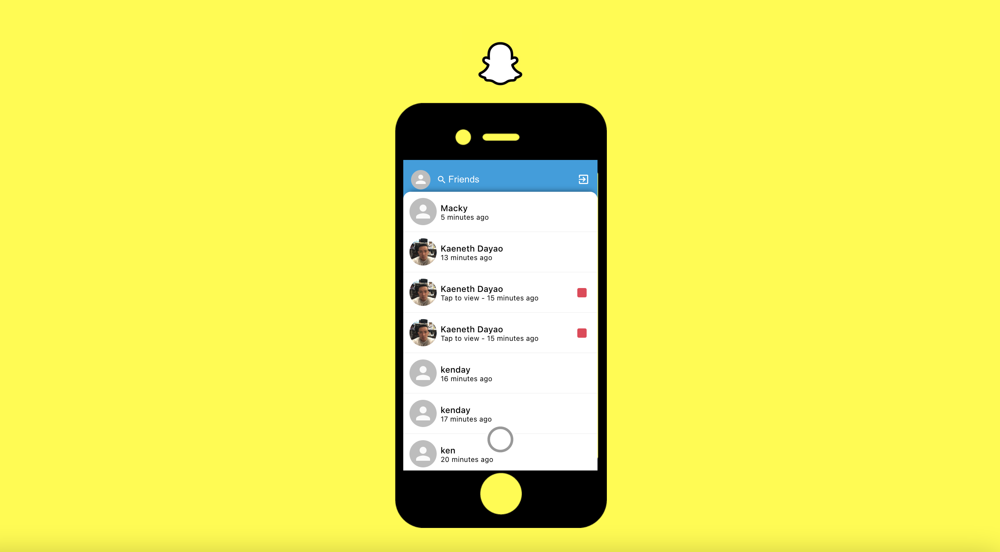

# Snapchat Clone

## Description

Take and post pictures with this snapchat-clone application built with React.js. This application uses Firebase for data storage and hosting, Material UI for styling, and redux for state management.

## Table of Contents

- [Description](#description)
- [Technology](#technology)
- [User Story](#user-story)
- [Installation](#installation)
- [Usage](#usage)
- [License](#license)
- [Contributing](#contributing)
- [Tests](#tests)
- [Questions](#questions)
- [Deployed Application URL](#deployed-application-URL)

## Technology

- React.js
- Firebase
- React Hooks
- Redux
- Material UI
- CSS
- HTML
- JavaScript

## User Story

## Installation

npm install any dependencies

## Usage

The deployed link will take you to the login page. On the login page, click on login or sign up. Click on log in to log into an existing account or log in with a google account. You can use the public login credentials below to login or you can click on signup to create a new account. Once logged in, click on the circle to take a picture or click on a post with a red marker to view a snap. To log out, click on the avatar on the upper left corner or the logout button on the upper right corner.

Public Login Credentials

- email: cool_coder@email.com
- password: 12341234

## License

## Contributing

Please follow standard contributing guidelines.

## Tests

No tests to run.

## Questions

For any questions, please contact kendayao at kendayao@gmail.com

## Deployed Application URL

Deployed application link: https://instagram-clone-bf736.web.app/

Video demo link: https://giphy.com/gifs/elyXzLN5eKt38UE67X/fullscreen

